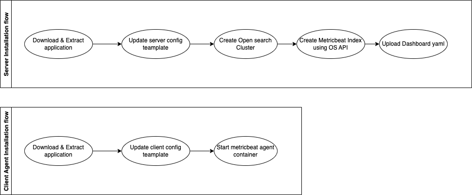

# OSS-Monitor-and-Alert-System
Monitor  &amp; Alert with Opensearch is a monintoring tool which will provide a Monitoring Dasboard and provide alerts based on some of the common metrics.
It will support the following modules to monitor
1. Linux
2. Unix
3. Windows
    * Note: It can support all the [modules](https://www.elastic.co/guide/en/beats/metricbeat/current/metricbeat-modules.html) currently supported by metricbeat in the future.


Behind the scene
---
The system consist of two main components
1. Opensearch Cluster:
   Opensearch cluster is a configurable multi node opensearch cluster which will be created using a docker compose file. In the future we can also provide a helm chart to support installation in kubernetes cluster. Once the cluster is up, a dashboard will be imported using the opensearch dashboard API. An alert configuration also will be uploaded using the import API(Future Scope). 
2. Metricbeat Agent which will needs to be installed on the system/containers which needs to be monitored. This will also be achieved using a docker compose which uses the metricbeat OSS docker image.
3. A sample template config will be provided both for server and client agent.




Installation Process
---

The installation consist of two steps
1. Download the server_config_template.cfg and modify the config details.
2. Installing the open search cluster with the following commands
   ```
   make install-server -config=<path_to_server_config>
   ```
3. Download client_config_template.cfg
4. Installing the metricbeat-oss(+logstash - maybe) clients to the Linux/Unix/Windows system
   ```
   make install-client -config=<path_to_client_config>
   ```


